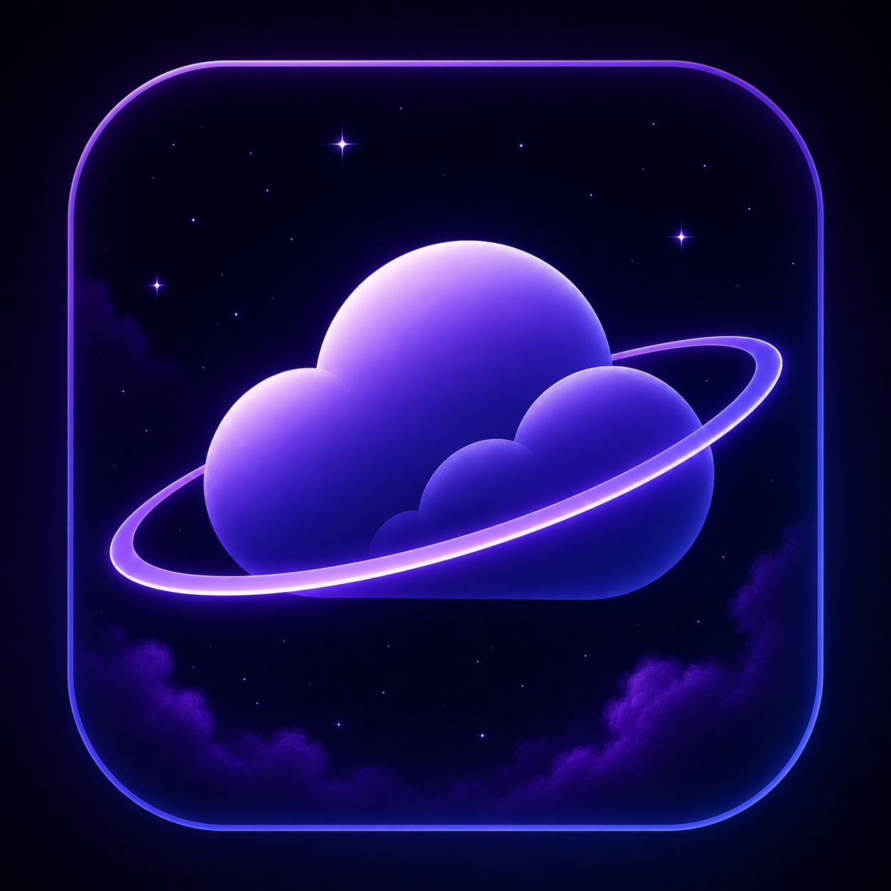

<p align="center">
  
</p>

<h1 align="center">Nimbus</h1>

<p align="center">
  A lightweight desktop video and audio downloader built with Python, yt-dlp, and pywebview.
</p>


## Features

- YouTube video and audio downloading
- Multiple quality options (minimum 720p, depending on the video)
- MP4 video output
- M4A audio output
- FFmpeg-powered video and audio merging into MP4
- Deno JavaScript runtime support
- Download progress, speed, and ETA
- Simple desktop interface


## Requirements

For running the pre-built release, no Python installation is required.

For building Nimbus from source:

- Python 3.11+
- Deno
- FFmpeg
- pywebview
- yt-dlp

Deno and FFmpeg are not included in the source repository. See the build instructions below.

## Running Nimbus

Download the latest portable release from the [Releases](https://github.com/Aswin-A-Arun/Nimbus/releases) page.

Extract the ZIP and run:

`Nimbus.exe`

## Building from Source

Clone the repository:

```bash
git clone https://github.com/Aswin-A-Arun/Nimbus.git
cd Nimbus
```

Install the Python dependencies:

```bash
pip install -r requirements.txt
```

Place the required Deno and FFmpeg binaries in:

```text
deno/
    deno.exe

ffmpeg/
    ffmpeg.exe
    ffprobe.exe
```

Then run Nimbus:

```bash
python launcher.py
```

## Building the Portable Version

Install PyInstaller:

```bash
pip install pyinstaller
```

Build Nimbus:

```powershell
pyinstaller --noconfirm --clean --onedir --noconsole --name Nimbus --icon "icon.ico" --add-data "frontend;frontend" --add-data "deno;deno" --add-data "ffmpeg;ffmpeg" launcher.py
```

The resulting application will be located in:

```text
dist/Nimbus/
```

Run `Nimbus.exe` from that folder.

## Project Structure

```text
Nimbus/
├── app.py
├── launcher.py
├── requirements.txt
├── icon.ico
├── frontend/
│   ├── index.html
│   ├── editor.js
│   └── styles.css
└── ...
```


## License

Nimbus is licensed under the [MIT License](LICENSE).

Nimbus uses third-party software and libraries that are distributed under
their respective licenses. These licenses do not change the license of
Nimbus itself.

See [THIRD-PARTY-NOTICES.md](THIRD-PARTY-NOTICES.md) for details.
